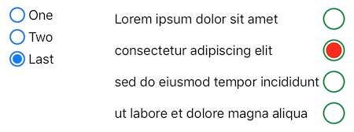

# RadioGroup

[![Swift Version][swift-image]][swift-url]
[![Build Status][travis-image]][travis-url]
[![License][license-image]][license-url]
[](https://img.shields.io/cocoapods/v/RadioGroup.svg)  
[](http://cocoapods.org/pods/RadioGroup)
[](http://makeapullrequest.com)

The missing iOS radio buttons group.

## Usage

```swift
let radioGroup = RadioGroup(titles: ["First Option Title", "Another Option Title", "Last"])
radioGroup.selectedIndex = 0
radioGroup.addTarget(self, action: #selector(optionSelected), forControlEvents: .valueChanged)
```

## SwiftUI Usage

```swift
RadioGroupPicker(selectedIndex: $selection, titles: ["One", "Two", "Three"])
    .fixedSize()
```

## Changing Appearance

The properties below can be set in Interface Builder, in code, or through a `UIAppearance` proxy (e.g., `RadioGroup.appearance().titleColor = .red`).
When using SwiftUI you can set them in the `RadioGroupPicker` initializer, or use as view modifiers (e.g., `.buttonSize(32)`). .

**Layout:**

```swift
radioGroup.isVertical = false           // default is true => buttons are stacked vertically
radioGroup.titleAlignment = .right
radioGroup.isButtonAfterTitle = true    // default is false => button left (leading) relative to title
```

**Color and Font:**

```swift
radioGroup.tintColor = .green       // surrounding ring
radioGroup.selectedColor = .red     // inner circle (default is same color as ring)
radioGroup.selectedTintColor = .blue  // selected radio button's surrounding ring (default is tintColor)

radioGroup.titleColor = .blue
radioGroup.titleFont = myFont
```

Or use attributed strings:

```swift
radioGroup.attributedTitles = [
    NSAttributedString(string: "Italic", attributes: [.obliqueness: 0.3]),
    NSAttributedString(string: "Underline", attributes: [.underlineStyle: 1]),
]
```

**Size:**

```swift
radioGroup.buttonSize = 42.0
radioGroup.spacing = 12             // spacing between buttons
radioGroup.itemSpacing = 12         // horizontal spacing between button and title
```

**Button appearance:**

```swift
RadioButton.appearance().size = 32              // height=width of button
RadioButton.appearance().ringWidth = 3
RadioButton.appearance().ringSpacing = 7        // space between outer ring and inner circle
RadioButton.appearance().selectedColor = .blue  // color of inner circle
```

## Installation

### CocoaPods:

```ruby
pod 'RadioGroup'
```

### Swift Package Manager:

```swift
dependencies: [
    .package(url: "https://github.com/yonat/RadioGroup", from: "1.4.3")
]
```

## Meta

[@yonatsharon](https://twitter.com/yonatsharon)

[https://github.com/yonat/RadioGroup](https://github.com/yonat/RadioGroup)

[swift-image]:https://img.shields.io/badge/swift-5.0-orange.svg
[swift-url]: https://swift.org/
[license-image]: https://img.shields.io/badge/License-MIT-blue.svg
[license-url]: LICENSE.txt
[travis-image]: https://img.shields.io/travis/dbader/node-datadog-metrics/master.svg?style=flat-square
[travis-url]: https://travis-ci.org/dbader/node-datadog-metrics
